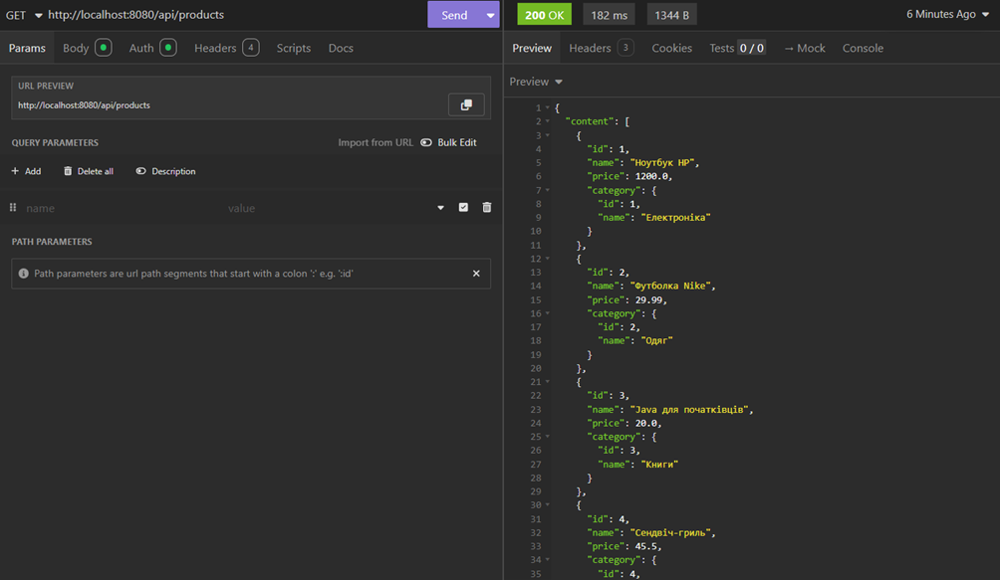
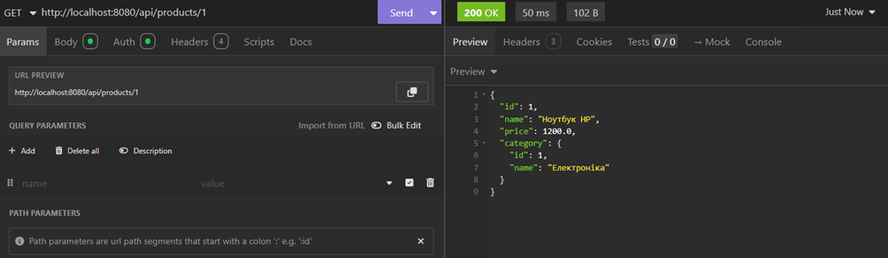
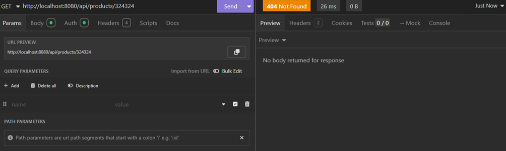
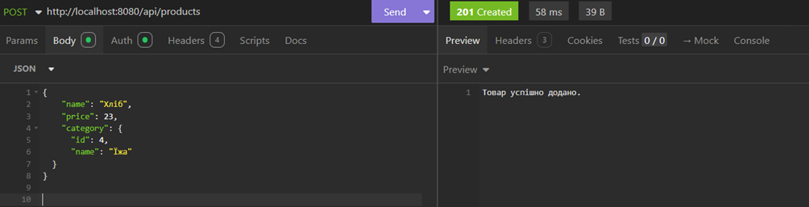
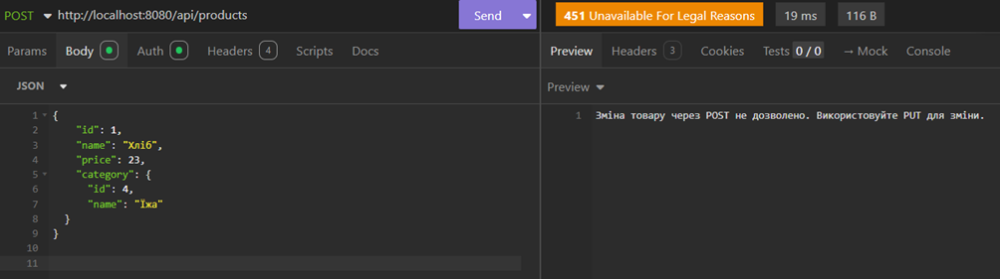
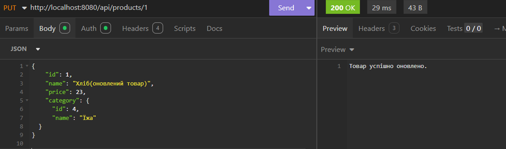
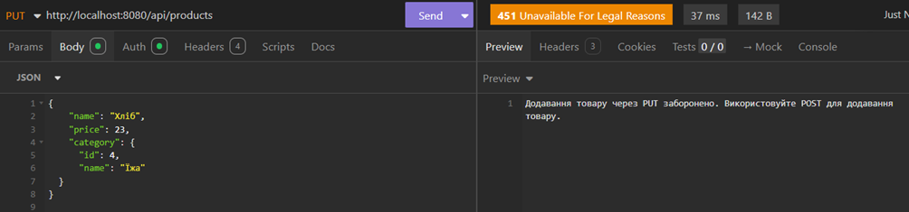
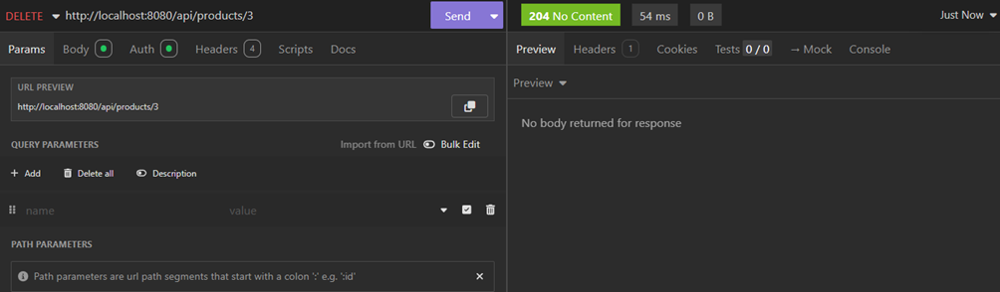

# Product Manager REST API

The project allows you to create and manage products through a REST API. The main features include adding new products, updating existing ones, deleting products, and viewing a list of products with filtering and pagination options.

## Tech Stack

- **Java** 
- **Spring Boot** for creating the REST API
- **Spring Data JPA** for interacting with the database
- **H2** for storing data
- **Maven** for dependency management

## API Endpoints

### 1. Get All Products (Paginated with Filtering)
- **URL**: `/api/products`
- **Method**: `GET`

### 2. Get Product by ID
- **URL**: `/api/products/{id}`
- **Method**: `GET`
- **Response**:
    - Status 200 (OK) with the product information if the product is found.
      
    - Status 404 (NOT FOUND) if the product is not found.
      
### 3. Add New Product
- **URL**: `/api/products`
- **Method**: `POST`
- **Request Body**: JSON object of the product
- **Response**:
    - Status 201 (CREATED) if the product is successfully added.
      
    - Status 451 (UNAVAILABLE_FOR_LEGAL_REASONS) if the product already has an ID.
      
### 4. Update Product
- **URL**: `/api/products/{id}`
- **Method**: `PUT`
- **Request Body**: JSON object of the product with ID.
- **Response**:
    - Status 200 (OK) if the product is successfully updated.
      
    - Status 451 (UNAVAILABLE_FOR_LEGAL_REASONS) if ID is missing.
      
### 5. Delete Product by ID
- **URL**: `/api/products/{id}`
- **Method**: `DELETE`
- **Response**:
    - Status 204 (NO CONTENT) if the product is successfully deleted.
      
    - Status 404 (NOT FOUND) if the product is not found.
      
## Testing the API

You can use tool like **Insomnia** to test the API.

### Example Request to Add a Product:

1. Method: `POST`
2. URL: `http://localhost:8080/api/products`
3. Request Body (JSON):
   ```json
    {
    "name": "Хліб",
    "price": 23,
    "category": {
      "id": 4,
      "name": "Їжа"
     }
    }
   ```
**Conclusion**

This is a simple REST API for managing products with filtering, sorting, and CRUD operations. It can be integrated into any web application for managing products.
